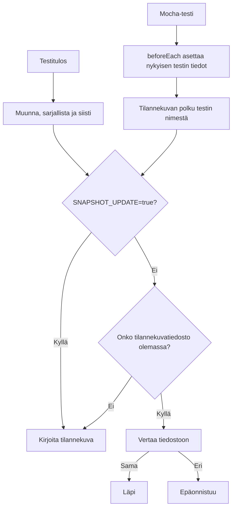

[English](README.md) | [Suomi](README.fi.md)

*Käännös on tehty GPT-5.6:n avustuksella.*

# test-notes

Omaan käyttöön tarkoitettu JavaScript- ja TypeScript-työkalukokoelma tilannekuvatestaukseen. Se tallentaa testitulokset tilannekuvatiedostoihin ja vertaa myöhempiä testiajoja niihin odottamattomien muutosten havaitsemiseksi.

## Keskeiset tiedostot

| Tiedosto | Tarkoitus |
|---|---|
| `src/match.ts` | Luo, lukee, vertaa ja päivittää tekstimuotoisia tilannekuvia. Tämä on päälogiikan aloituspiste. |
| `src/matchJSON.ts` | Tallentaa ja vertaa JSON-tilannekuvia. |
| `src/currentTest.ts`, `src/getKey.ts` | Määrittävät tilannekuvan polun nykyisen testin sijainnin ja nimen perusteella. |
| `src/transformJSON.ts` | Järjestää objektien avaimet ja esittää päivämäärien kaltaiset arvot, joita JSON ei suoraan tue. |
| `src/transformSchema.ts` | Poimii tiedon tyyppirakenteen tilanteisiin, joissa vain rakenne on merkityksellinen. |
| `src/maskString.ts` | Peittää muuttuvia merkkijonoja, kuten aikaleimoja ja muita epävakaita arvoja. |
| `tests/setup.ts` | Välittää nykyisen Mocha-testin tiedot työkalukokoelmalle. |
| `tests/__snapshots__/` | Sisältää testien käyttämät tilannekuvatiedostot. |

## Toimintaperiaate



## Paikallinen käyttö

Asenna riippuvuudet pnpm 7:llä ja käännä työkalukokoelma:

```bash
pnpm install --frozen-lockfile
pnpm run build
```

Viittaa käännöstulokseen Mocha-testitiedostosta ja aseta nykyisen testin tiedot:

```javascript
const notes = require('./path/to/test-notes/dist/index.cjs').default;

beforeEach(function () {
  notes.currentTest.file = this.currentTest.file;
  notes.currentTest.key = this.currentTest.titlePath().join('/');
});

it('matches the output', async function () {
  await notes.matchJSON({ a: 1 });
});
```

Muuta tuontipolku vastaamaan todellista hakemistorakennetta. Tilannekuvatiedostot tallennetaan testitiedostojen viereiseen `__snapshots__/`-hakemistoon.

Ensimmäinen ajo luo puuttuvat tilannekuvat. Kun olet varmistanut tuloksen muutoksen olevan odotettu, päivitä tilannekuvat asettamalla `SNAPSHOT_UPDATE=true`.

## Testit

```bash
pnpm test
```

Komento kääntää työkalukokoelman ennen Mocha-testien suorittamista.

Node.js 24:ää käytettäessä aseta:

```bash
NODE_OPTIONS=--no-experimental-strip-types pnpm test
```
