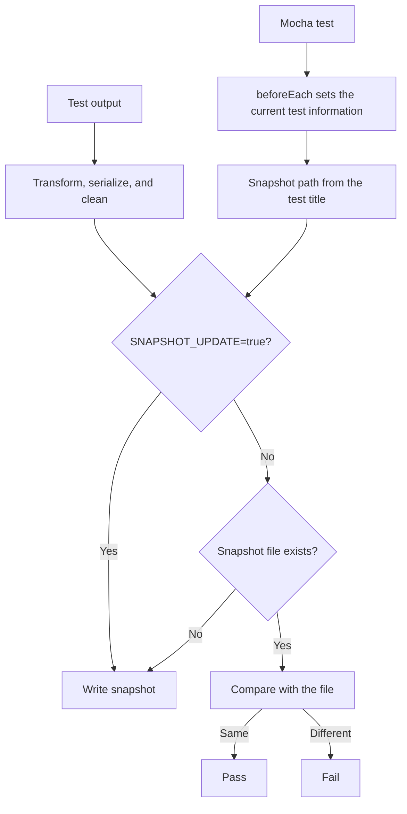

[English](README.md) | [Suomi](README.fi.md)

# test-notes

A personal JavaScript and TypeScript snapshot-testing toolkit. It saves test output to snapshot files and compares later runs against them to help detect unexpected changes.

## Main files

| File | Purpose |
|---|---|
| `src/match.ts` | Creates, reads, compares, and updates text snapshots. This is the main logic entry point. |
| `src/matchJSON.ts` | Saves and compares JSON snapshots. |
| `src/currentTest.ts`, `src/getKey.ts` | Determine the snapshot path from the current test's location and name. |
| `src/transformJSON.ts` | Sorts object keys and represents values such as dates that JSON does not directly support. |
| `src/transformSchema.ts` | Extracts the type structure of data for cases where only its shape matters. |
| `src/maskString.ts` | Masks dynamic strings, which is useful for cleaning timestamps and other unstable values. |
| `tests/setup.ts` | Passes the current Mocha test information to the toolkit. |
| `tests/__snapshots__/` | Stores the snapshot files used by the tests. |

## How it works



## Local usage

Install the dependencies with pnpm 7 and build the toolkit:

```bash
pnpm install --frozen-lockfile
pnpm run build
```

Reference the build output from a Mocha test file and set the current test information:

```javascript
const notes = require('./path/to/test-notes/dist/index.cjs').default;

beforeEach(function () {
  notes.currentTest.file = this.currentTest.file;
  notes.currentTest.key = this.currentTest.titlePath().join('/');
});

it('matches the output', async function () {
  await notes.matchJSON({ a: 1 });
});
```

Adjust the import path to match the actual directory layout. Snapshot files are stored in `__snapshots__/` beside the test files.

The first run creates missing snapshots. After confirming that an output change is expected, set `SNAPSHOT_UPDATE=true` to update them.

## Tests

```bash
pnpm test
```

This command builds the toolkit before running the Mocha tests.

With Node.js 24, set:

```bash
NODE_OPTIONS=--no-experimental-strip-types pnpm test
```
